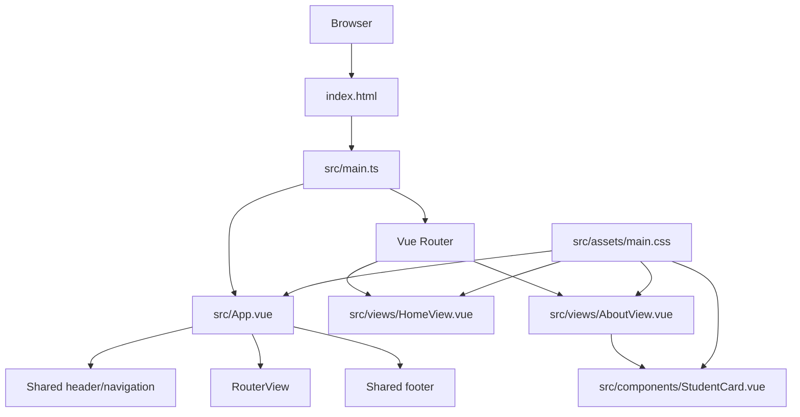

# Code Architecture

## Architecture overview

This project is a small **Vue 3 single-page application** built with **TypeScript and Vite**. It is currently a static portfolio website for a bachelor-project group, with no backend or database.



## Application startup

Execution begins in `src/main.ts`:

```ts
createApp(App).use(router).mount('#app')
```

This performs four operations:

1. Imports the global stylesheet.
2. Creates the Vue application.
3. Installs Vue Router.
4. Mounts `App.vue` inside the `#app` element from `index.html`.

## Root application shell

`src/App.vue` is the persistent page layout:

```text
App.vue
├── Header
│   ├── Wordmark
│   └── Navigation
├── RouterView
│   └── Current page component
└── Footer
```

The header and footer remain visible on every route. `<RouterView />` is the slot where Vue Router renders either the home or about page.

## Routing layer

`src/router/index.ts` defines two client-side routes:

| URL | Component | Purpose |
| --- | --- | --- |
| `/` | `HomeView.vue` | Landing and project introduction |
| `/about` | `AboutView.vue` | Team-member listing |

`createWebHistory()` provides normal-looking URLs without hash fragments. The hosting environment must redirect unknown routes back to `index.html`. Otherwise, refreshing `/about` could return a 404.

## View layer

### `HomeView.vue`

This is the landing page. It contains:

- Hero text and USN branding
- Links to the about page
- Bachelor-project introduction
- Team callout section

It currently contains only static content. There are no API requests or state-management interactions.

### `AboutView.vue`

This page owns a local `students` array:

```ts
const students = [
  { number: '01', name: '...', discipline: '...', focus: '...' },
  // ...
]
```

The template loops over that data:

```vue
<StudentCard
  v-for="student in students"
  :key="student.number"
  v-bind="student"
/>
```

`v-bind="student"` passes every student property to the corresponding component prop.

## Component layer

`src/components/StudentCard.vue` is the only extracted reusable component.

It declares a typed interface through `defineProps`:

```ts
defineProps<{
  number: string
  name: string
  discipline: string
  focus: string
}>()
```

The component only receives and displays information. It does not modify the data, access global state, or perform side effects. It is a presentational component.

The resulting data flow is one-way:

```text
AboutView student array
        ↓ props
StudentCard
        ↓
Rendered HTML
```

## Styling architecture

Most styling is centralized in `src/assets/main.css`, including:

- Color, typography, and spacing variables
- Shared header and footer rules
- Home-page layouts
- About-page layouts
- Student-card styling
- Responsive breakpoints at `900px` and `640px`
- Reduced-motion accessibility rules

`HomeView.vue` also contains one scoped style for `.USN-logo`. Scoped CSS only applies to elements inside that component.

A current architectural weakness is that `main.css` knows about nearly every component class. As the application grows, component-specific rules such as `.student-card` should live inside `StudentCard.vue`, while global design tokens and shared utilities remain in `main.css`.

## Tooling and tests

- **Vite** provides the development server and production bundling.
- **vue-tsc** performs Vue-aware TypeScript checking.
- **ESLint and oxlint** handle linting.
- **Prettier** handles formatting.
- **Vitest** is configured for unit tests, but there are currently no unit-test files.
- **Playwright** contains browser-level tests in `e2e/vue.spec.ts`.
- The `@` import alias points to `src`, so `@/components/...` means `src/components/...`.

The first Playwright test expects old placeholder elements such as `IMAGE HERE` and `USN LOGO`, but `HomeView.vue` now uses an actual image. This test appears stale and will likely fail.

**Pinia is installed but not initialized or used.** It is unnecessary at the moment because the site has no shared application state.

## Where to make common changes

| Desired change | Main location |
| --- | --- |
| Edit landing-page content | `src/views/HomeView.vue` |
| Edit team members | `src/views/AboutView.vue` |
| Change profile-card markup | `src/components/StudentCard.vue` |
| Change shared header/footer | `src/App.vue` |
| Add or change pages | `src/router/index.ts` and `src/views/` |
| Change colors or typography | `src/assets/main.css` |
| Add browser behavior tests | `e2e/vue.spec.ts` |
| Change build configuration | `vite.config.ts` |
| Add shared state later | Create `src/stores/` and initialize Pinia in `main.ts` |

## Summary

The application uses a straightforward component-based presentation architecture:

```text
Application shell → Routed views → Reusable components
```

It is intentionally simple and currently has no service, state-management, backend, or persistence layers.
